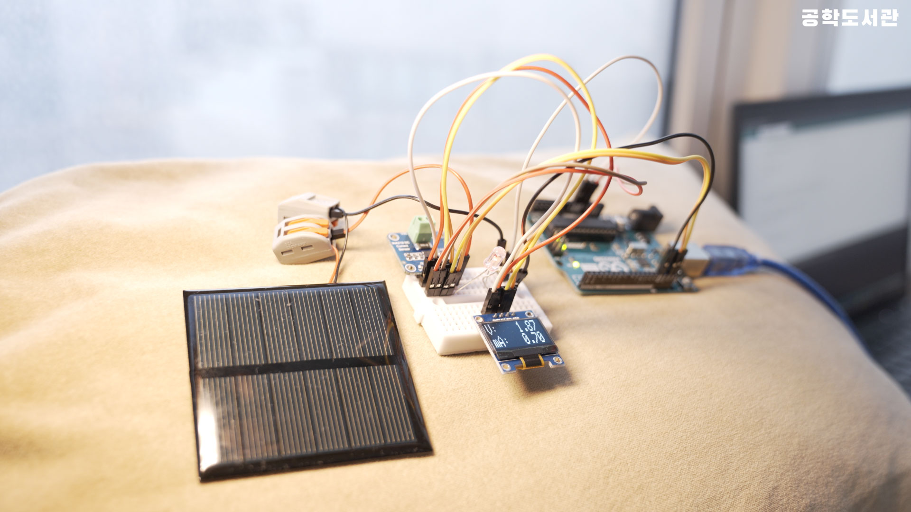
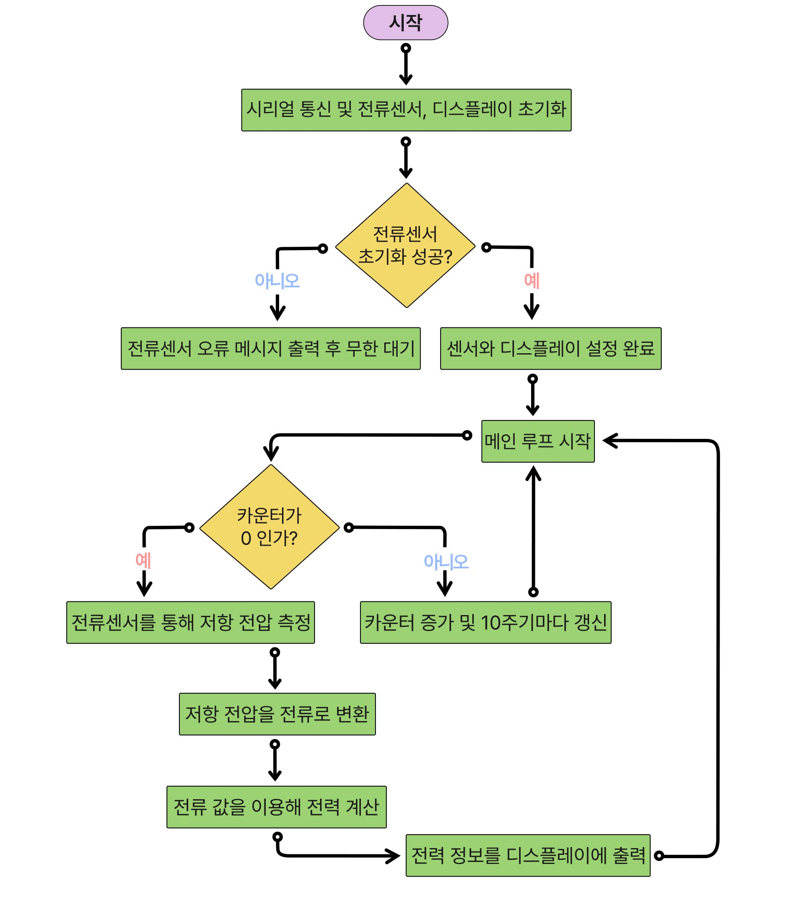

# 🎬 공학도서관 오리지널 컨텐츠

# ☀️ 태양광 전력 측정기 만들기

## 📝 프로젝트 소개
이 프로젝트는 태양광 패널과 전류 센서를 활용하여 생성되는 전기 에너지를 측정하고 시각화하는 장치를 만드는 과정을 설명합니다. LED의 밝기로 생성된 전력을 표현하고, OLED 디스플레이로 정확한 측정값을 확인할 수 있습니다.

## 📚 사전학습
이 프로젝트를 시작하기 전에 아래 내용을 먼저 공부하고 오시면 좋아요.

- 아두이노 기초
  - 아두이노 IDE 설치하기
  - I2C 통신 이해하기
  - 라이브러리 설치 방법 알아보기

- 전자부품 이해하기
  - 전압과 전류의 개념 알아보기
  - LED 연결 방법 이해하기
  - OLED 디스플레이 사용법 익히기

- 센서 활용하기
  - INA219 전류 센서 이해하기
  - 태양광 패널의 원리 알아보기
  - 전력 측정 방법 이해하기

## 🎯 성취 목표
- 태양광 패널에서 생성되는 전력을 측정할 수 있다.
- INA219 센서로 전압과 전류를 측정할 수 있다.
- OLED 디스플레이에 측정값을 표시할 수 있다.
- LED 밝기를 전력에 따라 조절할 수 있다.
- 실시간으로 전력 데이터를 모니터링할 수 있다.

## 🛠 준비물
- 아두이노 우노 보드
- 태양광 패널
- INA219 전류 센서 모듈
- OLED 디스플레이
- LED
- 저항
- 브레드보드
- 점퍼선

## 📋 회로 연결 방법

### 태양광 패널 연결
| 태양광 패널 | 연결 지점 |
|------------|----------|
| 빨간선(+)  | INA219 IN+ |
| 검정선(-)  | LED 저항   |

### INA219 센서 연결
| Arduino UNO | INA219 |
|------------|--------|
| SCL        | SCL    |
| SDA        | SDA    |
| 5V         | VCC    |
| GND        | GND    |

### OLED 디스플레이 연결
| INA219 | OLED    |
|--------|---------|
| VCC    | VCC     |
| GND    | GND     |
| SCL    | SCL     |
| SDA    | SDA     |

> **주의**: 전류 센서의 IN+, IN- 단자 연결 시 극성에 주의하세요!

## 💾 실습 코드
| 파일명 | 설명 |
|--------|------|
| [ppowermeter_oled_v2.ino](./src/powermeter_oled_v2/powermeter_oled_v2.ino) | 전력 측정 및 표시 코드 |

## 💻 주요 함수 설명
1. `ina219.getBusVoltage_V()`
   - 전체 회로의 전압 측정
   - 볼트(V) 단위로 반환

2. `ina219.getCurrent_mA()`
   - 회로에 흐르는 전류 측정
   - 밀리암페어(mA) 단위로 반환

## ➡️ 순서도

1. 전류센서로 전압/전류 측정 ➡️ 
2. LED 밝기 조절 ➡️ 
3. OLED에 측정값 표시

## 🚀 시작하기
1. 회로를 제시된 대로 연결
   - 태양광 패널 극성 확인
   - 센서 연결 확인

2. 라이브러리 설치하기
   - Adafruit_INA219 설치
   - Adafruit_SSD1306 설치
   - Adafruit_GFX 설치

3. 코드 업로드하기
   - 아두이노 IDE에서 코드 업로드
   - 연결 확인

4. 동작 테스트
   - 태양광 패널에 빛 비추기
   - OLED 표시 확인
   - LED 밝기 변화 관찰

## 🔍 문제해결
- 전력이 측정되지 않아요
  - 태양광 패널의 방향과 빛의 세기를 확인해보세요.
  - 전류 센서의 연결을 확인해보세요.

- OLED에 아무것도 표시되지 않아요
  - I2C 주소가 올바른지 확인해보세요.
  - 전원 연결을 확인해보세요.

- LED가 켜지지 않아요
  - 저항값이 적절한지 확인해보세요.
  - 연결이 올바른지 확인해보세요.

## 🌟 이렇게 업그레이드 해볼 수 있어요
- 데이터를 기록해볼까요?
  하루 동안의 발전량을 그래프로 볼 수 있어요.

- 발전량에 따라 다른 동작을 추가해볼까요?
  일정 전력 이상일 때 팬이 돌아가게 할 수 있어요.

- 태양광 패널의 각도를 자동으로 조절해볼까요?
  서보모터로 최적의 발전 각도를 찾을 수 있어요.

## 📚 참고 자료
- [INA219 데이터시트](https://www.ti.com/product/INA219)
- [Adafruit INA219 라이브러리](https://github.com/adafruit/Adafruit_INA219)
- [태양광 패널의 원리](https://www.arduino.cc/reference/en/libraries/ina219/)
